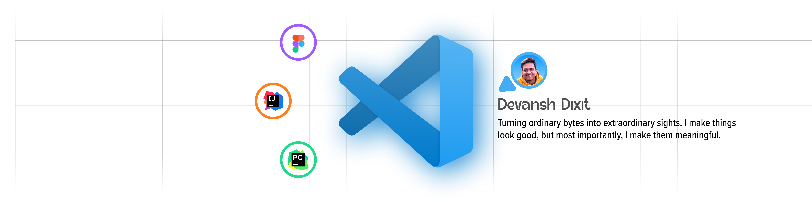

## 👋 About Me 👋

> 💻 Full-stack Developer | 🎨 UI/UX Designer | React + Node + Java + Figma

[](https://twitter.com/DevanshDix90156)
[](https://www.linkedin.com/in/DevanshDixit27/)
[](https://instagram.com/devanshdixit2743)
[](https://github.com/DevanshDixitDD)
[](mailto:devanshdixit2743@gmail.com)

💡  I'm a Full-stack Developer and UI/UX Designer based in Gwalior, M.P., India.

🎓  Currently, I'm in my final year pursuing B.Tech in Information Technology at the Institute of Technology and Management, Gwalior.

🌱  Turning ordinary bytes into extraordinary sights. I make things look good, but most importantly, I make them meaningful. I don't just design. I create experiences that stick around and matter. Inspired by everyday moments, my journey is fueled by storytelling, collaboration, and the belief that aesthetics can forge genuine connections between consumers and brands. 🌟✨ #DesignPassionately

✍️  During my downtime, you'll find me immersed in gaming, indulging in anime, or enjoying tunes on Spotify.

💬  Feel free to reach out if you'd like to connect or discuss anything further!

##  🎉 Skills  🎉
- **FrontEnd**: `React` `Redux` `NextJS` `SASS` `Webpack`
- **BackEnd**: `Node.js` `Express` `JavaEE`
- **Mobile**:  `Flutter` `Native Android`
- **UI Frameworks**: `Material-UI` `Bootstrap` `TailwindCSS` `Shadcn-UI`
- **Web technologies**: `HTML5` `CSS3` `ES7+` `a11y`
- **Databases**: `MongoDB` `MySQL` `Oracle` `Redis`
- **Misc**: `Git` `Github` `Eslint` `Prettier` `Linux` `Docker` `Bash` `SocketIO`
- **Languages**: `JavaScript` `TypeScript` `Java` `Dart` `SQL`

## ⚡ Stats ⚡
<!--START_SECTION:waka-->


**🐱 My GitHub Data** 

> 📦 347.1 kB Used in GitHub's Storage 
 > 
> 🚫 Not Opted to Hire
 > 
> 📜 16 Public Repositories 
 > 
> 🔑 7 Private Repositories 
 > 
**I'm a Night 🦉** 

```text
🌞 Morning                17 commits          ████░░░░░░░░░░░░░░░░░░░░░   15.60 % 
🌆 Daytime                26 commits          ██████░░░░░░░░░░░░░░░░░░░   23.85 % 
🌃 Evening                52 commits          ████████████░░░░░░░░░░░░░   47.71 % 
🌙 Night                  14 commits          ███░░░░░░░░░░░░░░░░░░░░░░   12.84 % 
```
📅 **I'm Most Productive on Tuesday** 

```text
Monday                   20 commits          █████░░░░░░░░░░░░░░░░░░░░   18.35 % 
Tuesday                  29 commits          ███████░░░░░░░░░░░░░░░░░░   26.61 % 
Wednesday                10 commits          ██░░░░░░░░░░░░░░░░░░░░░░░   09.17 % 
Thursday                 13 commits          ███░░░░░░░░░░░░░░░░░░░░░░   11.93 % 
Friday                   20 commits          █████░░░░░░░░░░░░░░░░░░░░   18.35 % 
Saturday                 12 commits          ███░░░░░░░░░░░░░░░░░░░░░░   11.01 % 
Sunday                   5 commits           █░░░░░░░░░░░░░░░░░░░░░░░░   04.59 % 
```


📊 **This Week I Spent My Time On** 

```text
🕑︎ Time Zone: Asia/Kolkata

💬 Programming Languages: 
JavaScript               1 hr 41 mins        ████████████████████████░   96.38 % 
HTML                     1 min               ░░░░░░░░░░░░░░░░░░░░░░░░░   01.83 % 
CSS                      1 min               ░░░░░░░░░░░░░░░░░░░░░░░░░   01.79 % 

🔥 Editors: 
VS Code                  1 hr 44 mins        █████████████████████████   100.00 % 

🐱‍💻 Projects: 
test-project             1 hr 44 mins        █████████████████████████   100.00 % 

💻 Operating System: 
Windows                  1 hr 44 mins        █████████████████████████   100.00 % 
```

**I Mostly Code in TypeScript** 

```text
TypeScript               7 repos             ███████████░░░░░░░░░░░░░░   43.75 % 
JavaScript               5 repos             ████████░░░░░░░░░░░░░░░░░   31.25 % 
CSS                      2 repos             ███░░░░░░░░░░░░░░░░░░░░░░   12.50 % 
C++                      2 repos             ███░░░░░░░░░░░░░░░░░░░░░░   12.50 % 
```


**Timeline**


 Last Updated on 17/03/2025 18:44:30 UTC
<!--END_SECTION:waka-->
