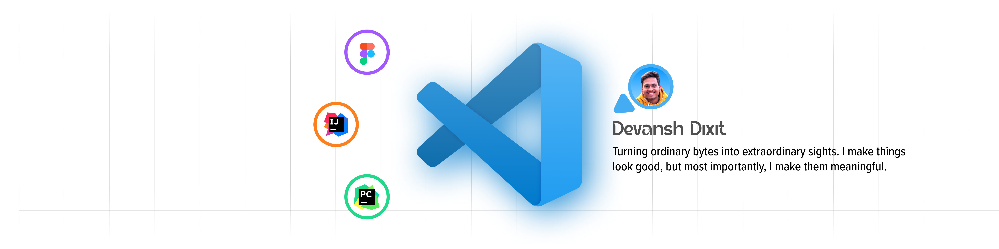

## 👋 About Me 👋

> 💻 Full-stack Developer | 🎨 UI/UX Designer | React + Node + Java + Figma

[](https://twitter.com/DevanshDix90156)
[](https://www.linkedin.com/in/DevanshDixit27/)
[](https://instagram.com/devanshdixit2743)
[](https://github.com/DevanshDixitDD)
[](mailto:devanshdixit2743@gmail.com)

💡  I'm a Full-stack Developer and UI/UX Designer based in Gwalior, M.P., India.

🎓  Currently, I'm in my final year pursuing B.Tech in Information Technology at the Institute of Technology and Management, Gwalior.

🌱  Turning ordinary bytes into extraordinary sights. I make things look good, but most importantly, I make them meaningful. I don't just design. I create experiences that stick around and matter. Inspired by everyday moments, my journey is fueled by storytelling, collaboration, and the belief that aesthetics can forge genuine connections between consumers and brands. 🌟✨ #DesignPassionately

✍️  During my downtime, you'll find me immersed in gaming, indulging in anime, or enjoying tunes on Spotify.

💬  Feel free to reach out if you'd like to connect or discuss anything further!

##  🎉 Skills  🎉
- **FrontEnd**: `React` `Redux` `NextJS` `SASS` `Webpack`
- **BackEnd**: `Node.js` `Express` `JavaEE`
- **Mobile**:  `Flutter` `Native Android`
- **UI Frameworks**: `Material-UI` `Bootstrap` `TailwindCSS` `Shadcn-UI`
- **Web technologies**: `HTML5` `CSS3` `ES7+` `a11y`
- **Databases**: `MongoDB` `MySQL` `Oracle` `Redis`
- **Misc**: `Git` `Github` `Eslint` `Prettier` `Linux` `Docker` `Bash` `SocketIO`
- **Languages**: `JavaScript` `TypeScript` `Java` `Dart` `SQL`

## ⚡ Stats ⚡
<!--START_SECTION:waka-->


**🐱 My GitHub Data** 

> 📦 365.7 kB Used in GitHub's Storage 
 > 
> 🏆 2 Contributions in the Year 2026
 > 
> 🚫 Not Opted to Hire
 > 
> 📜 17 Public Repositories 
 > 
> 🔑 8 Private Repositories 
 > 
**I'm a Night 🦉** 

```text
🌞 Morning                27 commits          ██████░░░░░░░░░░░░░░░░░░░   22.13 % 
🌆 Daytime                17 commits          ███░░░░░░░░░░░░░░░░░░░░░░   13.93 % 
🌃 Evening                59 commits          ████████████░░░░░░░░░░░░░   48.36 % 
🌙 Night                  19 commits          ████░░░░░░░░░░░░░░░░░░░░░   15.57 % 
```
📅 **I'm Most Productive on Thursday** 

```text
Monday                   19 commits          ████░░░░░░░░░░░░░░░░░░░░░   15.57 % 
Tuesday                  23 commits          █████░░░░░░░░░░░░░░░░░░░░   18.85 % 
Wednesday                14 commits          ███░░░░░░░░░░░░░░░░░░░░░░   11.48 % 
Thursday                 24 commits          █████░░░░░░░░░░░░░░░░░░░░   19.67 % 
Friday                   19 commits          ████░░░░░░░░░░░░░░░░░░░░░   15.57 % 
Saturday                 18 commits          ████░░░░░░░░░░░░░░░░░░░░░   14.75 % 
Sunday                   5 commits           █░░░░░░░░░░░░░░░░░░░░░░░░   04.10 % 
```


📊 **This Week I Spent My Time On** 

```text
🕑︎ Time Zone: Asia/Kolkata

💬 Programming Languages: 
No Activity Tracked This Week

🔥 Editors: 
No Activity Tracked This Week

🐱‍💻 Projects: 
No Activity Tracked This Week

💻 Operating System: 
No Activity Tracked This Week
```

**I Mostly Code in TypeScript** 

```text
TypeScript               8 repos             ████████████░░░░░░░░░░░░░   47.06 % 
JavaScript               5 repos             ███████░░░░░░░░░░░░░░░░░░   29.41 % 
CSS                      2 repos             ███░░░░░░░░░░░░░░░░░░░░░░   11.76 % 
C++                      2 repos             ███░░░░░░░░░░░░░░░░░░░░░░   11.76 % 
```


**Timeline**


 Last Updated on 02/03/2026 19:09:53 UTC
<!--END_SECTION:waka-->
