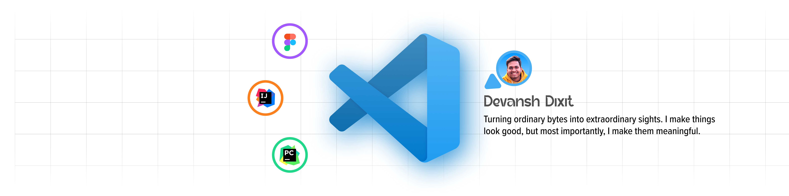

## 👋 About Me 👋

> 💻 Full-stack Developer | 🎨 UI/UX Designer | React + Node + Java + Figma

[](https://twitter.com/DevanshDix90156)
[](https://www.linkedin.com/in/DevanshDixit27/)
[](https://instagram.com/devanshdixit2743)
[](https://github.com/DevanshDixitDD)
[](mailto:devanshdixit2743@gmail.com)

💡  I'm a Full-stack Developer and UI/UX Designer based in Gwalior, M.P., India.

🎓  Currently, I'm in my final year pursuing B.Tech in Information Technology at the Institute of Technology and Management, Gwalior.

🌱  Turning ordinary bytes into extraordinary sights. I make things look good, but most importantly, I make them meaningful. I don't just design. I create experiences that stick around and matter. Inspired by everyday moments, my journey is fueled by storytelling, collaboration, and the belief that aesthetics can forge genuine connections between consumers and brands. 🌟✨ #DesignPassionately

✍️  During my downtime, you'll find me immersed in gaming, indulging in anime, or enjoying tunes on Spotify.

💬  Feel free to reach out if you'd like to connect or discuss anything further!

##  🎉 Skills  🎉
- **FrontEnd**: `React` `Redux` `NextJS` `SASS` `Webpack`
- **BackEnd**: `Node.js` `Express` `JavaEE`
- **Mobile**:  `Flutter` `Native Android`
- **UI Frameworks**: `Material-UI` `Bootstrap` `TailwindCSS` `Shadcn-UI`
- **Web technologies**: `HTML5` `CSS3` `ES7+` `a11y`
- **Databases**: `MongoDB` `MySQL` `Oracle` `Redis`
- **Misc**: `Git` `Github` `Eslint` `Prettier` `Linux` `Docker` `Bash` `SocketIO`
- **Languages**: `JavaScript` `TypeScript` `Java` `Dart` `SQL`

## ⚡ Stats ⚡
<!--START_SECTION:waka-->


**🐱 My GitHub Data** 

> 📦 573.1 kB Used in GitHub's Storage 
 > 
> 🏆 24 Contributions in the Year 2026
 > 
> 🚫 Not Opted to Hire
 > 
> 📜 17 Public Repositories 
 > 
> 🔑 9 Private Repositories 
 > 
**I'm a Night 🦉** 

```text
🌞 Morning                31 commits          █████░░░░░░░░░░░░░░░░░░░░   21.68 % 
🌆 Daytime                19 commits          ███░░░░░░░░░░░░░░░░░░░░░░   13.29 % 
🌃 Evening                74 commits          █████████████░░░░░░░░░░░░   51.75 % 
🌙 Night                  19 commits          ███░░░░░░░░░░░░░░░░░░░░░░   13.29 % 
```
📅 **I'm Most Productive on Thursday** 

```text
Monday                   22 commits          ████░░░░░░░░░░░░░░░░░░░░░   15.38 % 
Tuesday                  23 commits          ████░░░░░░░░░░░░░░░░░░░░░   16.08 % 
Wednesday                20 commits          ███░░░░░░░░░░░░░░░░░░░░░░   13.99 % 
Thursday                 25 commits          ████░░░░░░░░░░░░░░░░░░░░░   17.48 % 
Friday                   20 commits          ███░░░░░░░░░░░░░░░░░░░░░░   13.99 % 
Saturday                 18 commits          ███░░░░░░░░░░░░░░░░░░░░░░   12.59 % 
Sunday                   15 commits          ███░░░░░░░░░░░░░░░░░░░░░░   10.49 % 
```


📊 **This Week I Spent My Time On** 

```text
🕑︎ Time Zone: Asia/Kolkata

💬 Programming Languages: 
TypeScript               54 mins             ████████████████████░░░░░   79.19 % 
MDX                      12 mins             ████░░░░░░░░░░░░░░░░░░░░░   17.94 % 
Markdown                 1 min               █░░░░░░░░░░░░░░░░░░░░░░░░   02.02 % 
Text                     0 secs              ░░░░░░░░░░░░░░░░░░░░░░░░░   00.84 % 
CSS                      0 secs              ░░░░░░░░░░░░░░░░░░░░░░░░░   00.01 % 

🔥 Editors: 
VS Code                  34 mins             █████████████░░░░░░░░░░░░   50.10 % 
Claude Code              34 mins             ████████████░░░░░░░░░░░░░   49.90 % 

🐱‍💻 Projects: 
des-portfolio-2026       1 hr 9 mins         █████████████████████████   100.00 % 

💻 Operating System: 
Windows                  1 hr 9 mins         █████████████████████████   100.00 % 
```

🤖 **AI Coding This Week** 

```text
⏱ AI Coding Time: 41 mins (59.58%)

✍️ 360 lines written by AI, 8 lines written by hand (97.83% AI-written)

🔤 188,846 Input Tokens, 65,415 Output Tokens

💵 $2.15 Estimated AI Cost This Week

🧠 2 AI Sessions, 7 AI Prompts

Sonnet                   360 lines           █████████████████████████   100.00 % 

🔎 AI Coding Insights:
🤖 AI-Driven — 97.83% of written lines came from AI
📄 Detailed Prompter — average 1,023 characters per prompt
🔁 Iterative Prompter — average 4 prompts per session
🚀 High AI Trust — 2.7% of changed lines were hand-edited
```

**I Mostly Code in TypeScript** 

```text
TypeScript               9 repos             ████████████░░░░░░░░░░░░░   50.00 % 
JavaScript               5 repos             ███████░░░░░░░░░░░░░░░░░░   27.78 % 
CSS                      2 repos             ███░░░░░░░░░░░░░░░░░░░░░░   11.11 % 
C++                      2 repos             ███░░░░░░░░░░░░░░░░░░░░░░   11.11 % 
```


**Timeline**


 Last Updated on 01/10/2026 22:49:31 UTC
<!--END_SECTION:waka-->
